# Práctica 2: la misma máquina en código

Grupo 2

- Adolfo Alejandro Arenas Ramos, 1152370
- Jorge Andrés Reyes Serrano, 1152355

## Qué se construyó

La infraestructura quedó declarada con Terraform. Incluye una máquina virtual `web-tf`, una regla de cortafuegos para HTTP, una dirección IP externa estática y un backend de Cloud Storage para guardar el estado. El repositorio conserva el código que permite reproducirla.

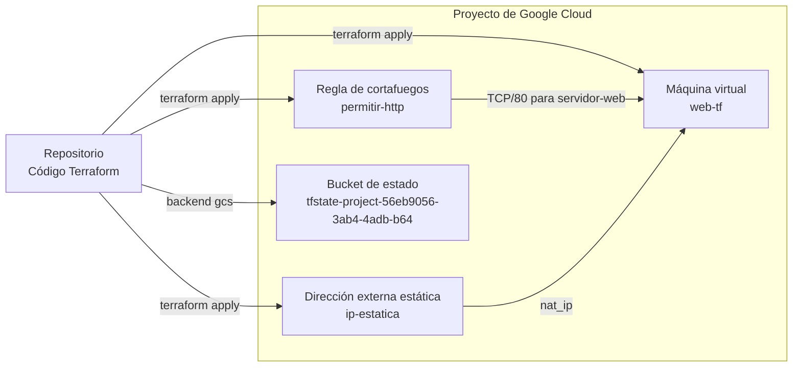

## Evidencias

### Fase 1: máquina y regla de cortafuegos

Se nos olvidó la evidencia de esta 😅

### Fase 2: salida y comprobación

Terraform devolvió la IP externa de la máquina:

```console
$ terraform output ip_externa
"34.123.27.96"
```

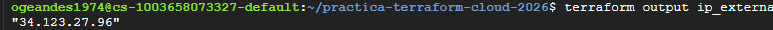

La solicitud HTTP llegó al servidor nginx desplegado por el script de arranque:

```console
$ curl -m 8 http://$(terraform output -raw ip_externa)
<h1><identificacion></h1><p>Servida desde Terraform por web-tf</p>
```

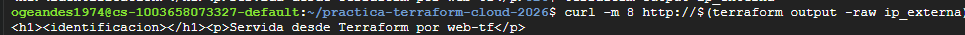

### Fase 3: idempotencia y deriva

Sin cambiar la configuración, un nuevo `apply` no modificó ningún recurso:

```console
$ terraform apply
No changes. Your infrastructure matches the configuration.

Apply complete! Resources: 0 added, 0 changed, 0 destroyed.
```

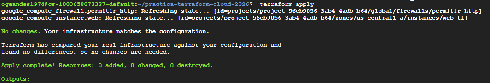

Después de agregar manualmente la etiqueta `prueba-manual`, Terraform detectó la deriva y propuso retirarla:

```console
$ terraform plan
~ resource "google_compute_instance" "web" {
    tags = [
      - "prueba-manual",
        "servidor-web",
    ]
  }

Plan: 0 to add, 1 to change, 0 to destroy.
```

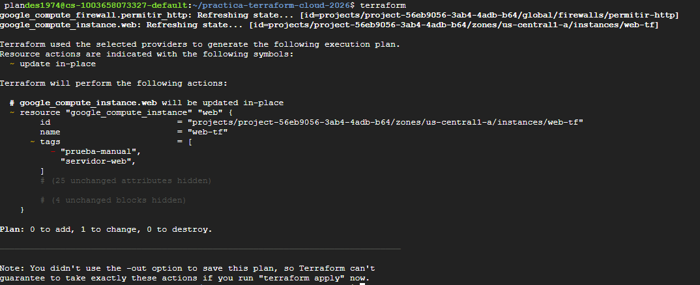

Tras aplicar el plan, la instancia volvió a tener únicamente la etiqueta declarada en el código:

```console
$ gcloud compute instances describe web-tf --format="value(tags.items)"
servidor-web
```

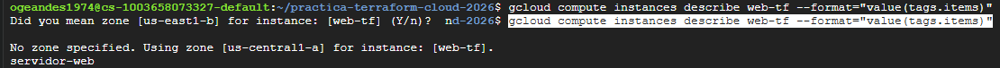

### Fase 4: variables y cambio de tipo

El primer intento de cambiar el tipo de máquina fue rechazado porque la configuración todavía no autorizaba detener la instancia:

```console
$ terraform apply -var tipo_maquina=e2-small
Plan: 0 to add, 1 to change, 0 to destroy.

Error: Changing the machine_type ... on a started instance requires stopping it.
To acknowledge this, please set allow_stopping_for_update = true in your config.
```

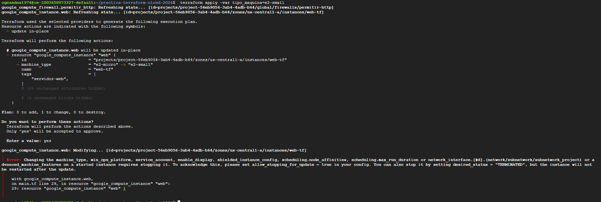

Después de agregar `allow_stopping_for_update = true`, la IP efímera cambió. Las dos IP registradas fueron:

| Momento | IP externa |
|---|---|
| Antes del cambio | `34.123.27.96` |
| Después del cambio | `34.31.161.146` |

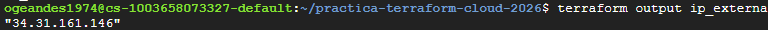

### Fase 5: destruir y volver a crear

La destrucción de los dos recursos tomó 24,703 segundos:

```console
Destroy complete! Resources: 2 destroyed.

real    0m24.703s
user    0m3.023s
sys     0m0.588s
```

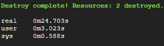

La recreación tomó 40,551 segundos:

```console
Apply complete! Resources: 2 added, 0 changed, 0 destroyed.

Outputs:

ip_externa = "34.123.27.96"

real    0m40.551s
user    0m2.640s
sys     0m0.433s
```

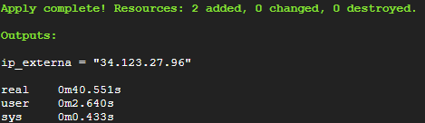

### Fase 6: estado remoto

El estado remoto registró la máquina y la regla de cortafuegos. El archivo `default.tfstate` apareció en el bucket y el plan siguió funcionando después de borrar la copia local:

```console
$ terraform state list
google_compute_firewall.permitir_http

$ gcloud storage ls gs://tfstate-project-56eb9056-3ab4-4adb-b64/practica-2/
gs://tfstate-project-56eb9056-3ab4-4adb-b64/practica-2/default.tfstate

$ rm terraform.tfstate terraform.tfstate.backup
$ terraform plan
No changes. Your infrastructure matches the configuration.
```

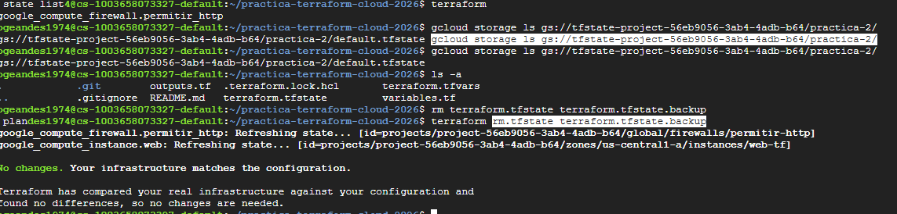

### Reto: dirección IP estática

El plan del reto agregó la dirección estática y actualizó la interfaz de red sin destruir la máquina:

```console
Plan: 1 to add, 1 to change, 0 to destroy.
```

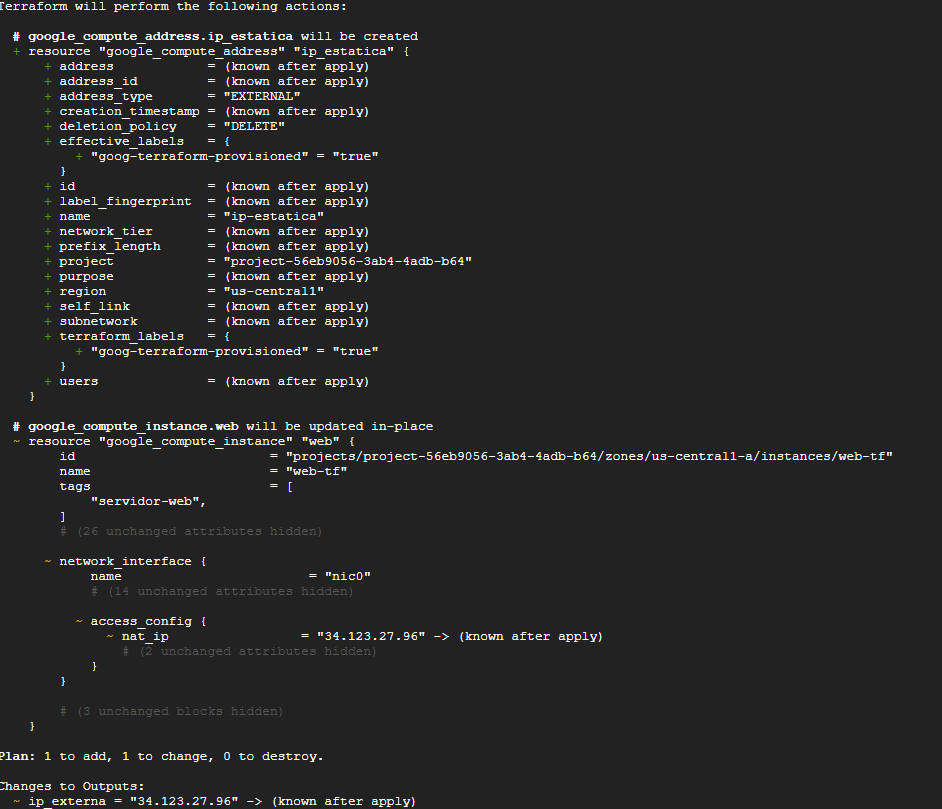

La IP registrada después del cambio de tipo fue:

```console
$ terraform output ip_externa
"34.172.48.57"
```

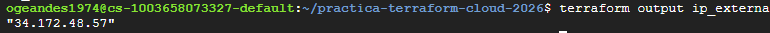

La salida anterior al cambio fue sobrescrita en la consola y no quedó visible en la captura disponible:

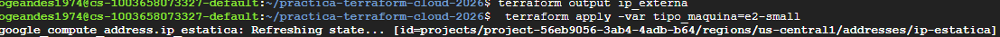

### Fase 7: dejar el proyecto limpio

Terraform destruyó los tres recursos administrados y el estado quedó vacío. Las consultas de instancias, discos y direcciones devolvieron cero elementos; la consulta de la regla de cortafuegos devolvió una lista JSON vacía:

```console
Destroy complete! Resources: 3 destroyed.

$ terraform state list

$ gcloud compute instances list
Listed 0 items.

$ gcloud compute disks list
Listed 0 items.

$ gcloud compute addresses list
Listed 0 items.

$ gcloud compute firewall-rules list --filter="name=permitir-http" --format=json
[]
```

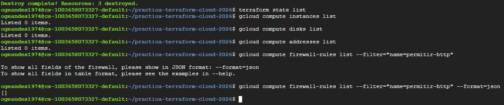

El historial del repositorio conserva los commits realizados durante la práctica:

```console
$ git log --oneline
6c5e6a0 IP estática
25e87cb Estado en Cloud Storage
44060a8 allow stopping for update en main.tf
bb1c557 las vars obvio van sin comillas smh
20d3df2 usar las vars en el main.tf
c4a17cb añadir las vars
acabbf1 hacer el outputs.tf
b08f0bc Máquina y regla de cortafuegos en Terraform
7cad638 crear el archivo de terraform
25aa2d6 añadir script de arranque de la prac1
d21613f el gitignore
e60e2d1 Initial commit
```

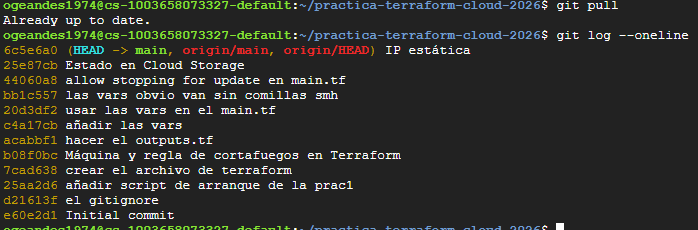

La pestaña de facturación en google cloud no estaba actualizada.

## Tabla de tiempos

| Cómo | Tiempo | Qué queda después |
|---|---:|---|
| Interfaz gráfica, Práctica 1 fase 1 | No registrado en el documento | Nada. Ni siquiera la lista de clics. |
| `gcloud`, Práctica 1 fase 5 | 14,752 s | Un comando en el historial, si no se borra. |
| Terraform, práctica actual | 40,551 s | Un repositorio que cualquiera puede clonar, leer y volver a ejecutar, con el historial de cómo llegó a ser lo que es. |

## Respuestas breves

### 1. Recurso creado manualmente

Si alguien hubiera creado la máquina `web-manual` por fuera de Terraform, `terraform plan` no habría propuesto cambiarla ni eliminarla. Terraform compara la configuración con los recursos que registra en su estado. Como `web-manual` no aparecería en ese estado, Terraform no la consideraría parte de la infraestructura administrada.

Por la misma razón, `terraform destroy` tampoco la habría eliminado. Ese comando destruye los recursos registrados en el estado, no todos los recursos que encuentra dentro del proyecto. La máquina manual habría seguido encendida hasta que alguien la borrara directamente o la importara al estado de Terraform.

### 2. Bucket del estado creado por fuera de Terraform

El bucket debe existir antes de ejecutar `terraform init`, porque Terraform necesita conectarse al backend para leer y guardar el estado. Declararlo en el mismo código cuyo estado se quiere guardar allí crea un problema de arranque: Terraform necesitaría el bucket para poder administrar la creación del propio bucket.

También sería peligroso incluirlo en el mismo conjunto de recursos. Al ejecutar `terraform destroy`, Terraform intentaría borrar el bucket junto con la infraestructura.

### 3. Estimación de costos

La infraestructura encendida costaría $7.31 dólares al mes.

Según la calculadora tener la infraestructura prendida durante la práctica costó 1.23 dólares pero no se pudo confirmar porque la facturación en google cloud no estaba actualizada.

El bucket de Cloud Storage sigue cobrando, se decidió conservarlo porque es el que guarda el estado de Terraform.
